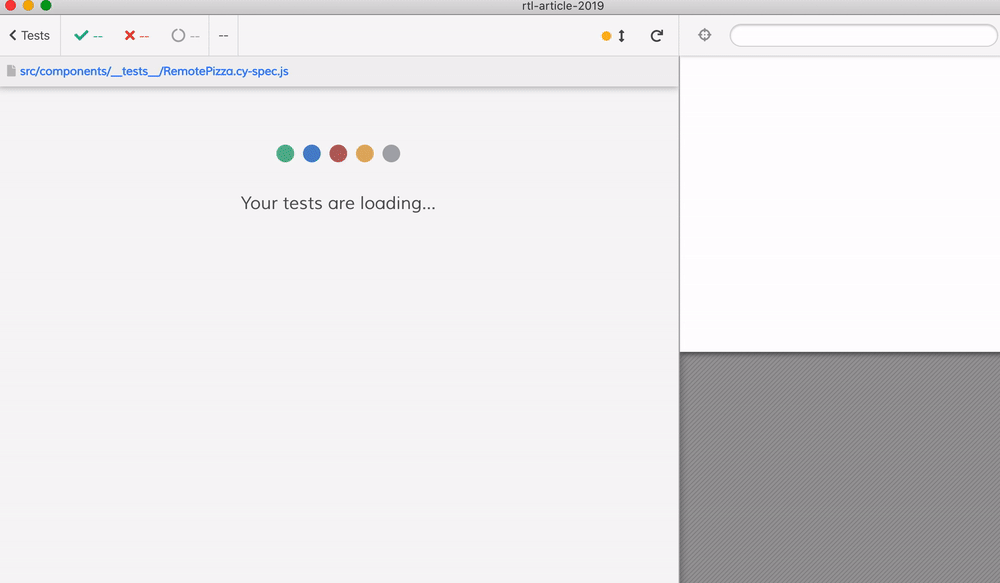

# Modern React testing article examples: React Testing Library

Examples for the React Testing Library part of the article series on testing React components:

- [Modern React testing: best practices](https://blog.sapegin.me/all/react-testing-1-best-practices/)
- [Modern React testing: Jest and Enzyme](https://blog.sapegin.me/all/react-testing-2-jest-and-enzyme/)
- [Modern React testing: Jest and React Testing Library](https://blog.sapegin.me/all/react-testing-3-jest-and-react-testing-library/)

## Cypress component tests

Using [cypress-react-unit-test](https://github.com/bahmutov/cypress-react-unit-test) are in [src/components/**tests**](src/components/__tests__) next to Jest tests. Each spec has built-in Cypress commands and [@testing-library/cypress](https://testing-library.com/docs/cypress-testing-library/intro) commands.

```js
// Hello.cy-spec.js
import React from 'react';
import { mount } from 'cypress-react-unit-test';

it('hello world', () => {
  mount(<p>Hello Jest!</p>);
  // https://on.cypress.io/contains
  cy.contains('Hello Jest!');
  // equivalent testing-library command
  cy.findByText('Hello Jest!');
});
```

- [Hello.cy-spec.js](src/components/__tests__/Hello.cy-spec.js)
- [Login.cy-spec.js](src/components/__tests__/Login.cy-spec.js)
- [ExpandCollapse.cy-spec.js](src/components/__tests__/ExpandCollapse.cy-spec.js)
- [Pizza.cy-spec.js](src/components/__tests__/Pizza.cy-spec.js)
- [RemotePizza.cy-spec.js](src/components/__tests__/RemotePizza.cy-spec.js) shows network mock, dependency injection passing, module import mock, and `defaultProps` method mock.



Read [My Vision for Component Tests in Cypress](https://glebbahmutov.com/blog/my-vision-for-component-tests/)
